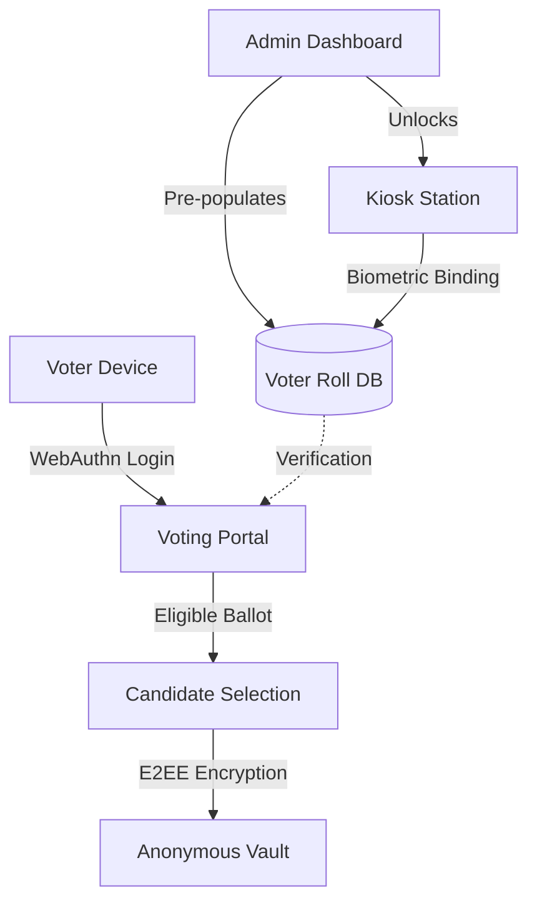
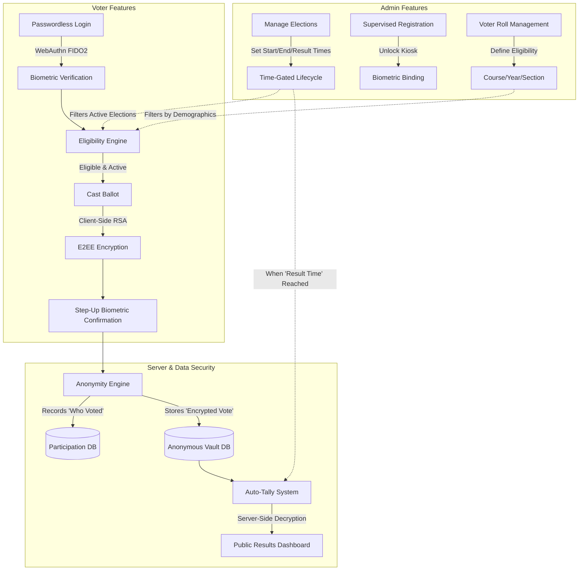

# DBPVS | System Data Flow & Architecture

This document explains the technical flow of data within the **Device-Bound Passwordless Voting System (V2 Pro)**.

---

## 1. The High-Level Architecture
The system is built on a **Trust-But-Verify** model. The Admin controls the "Voter Roll" (identity), but the "Ballot Box" (votes) is cryptographically decoupled to ensure anonymity.

---

## 1.5 System Features Overview

The following flowchart maps out the core features of the system and how they interact across the Admin, Voter, and Server layers:

---

## 2. Supervised Kiosk Registration Flow
To prevent identity hijacking, registration is a 3-step physical process:

1.  **Pre-population**: The Admin adds student details (Roll No, Name, Course) to the `users` table. The `is_registered` flag is `FALSE`.
2.  **Physical ID Check**: The student presents their college ID to the Admin at a kiosk.
3.  **Admin Unlock**: The Admin clicks "Unlock" in the Dashboard. This sets `registration_unlocked = TRUE` in the DB for that Roll Number.
4.  **Biometric Binding**: The student uses the Kiosk (or their device) to generate a **WebAuthn Credential**. 
    *   The **Public Key** is stored in the DB.
    *   `is_registered` becomes `TRUE`.
    *   `registration_unlocked` is reset to `FALSE`.

---

## 3. The Voting Lifecycle (Step-by-Step)

### Step A: Biometric Authentication
*   Voter enters their **Roll Number**.
*   The server sends a "Challenge" to the browser.
*   The browser triggers the **Native Biometric Sensor** (Fingerprint/FaceID).
*   The device signs the challenge using the **Private Key** stored in the secure enclave.
*   The server verifies the signature against the **Public Key** in the `users` table.

### Step B: Eligibility Engine
*   Once logged in, the server checks the voter's metadata (`Course`, `Year`, `Section`).
*   The server queries the `elections` table for active elections matching these rules.
*   The voter only sees ballots they are legally allowed to cast.

### Step C: E2EE Ballot Casting
1.  **Selection**: Voter selects a candidate.
2.  **Client-Side Encryption**: The browser encrypts the candidate ID using the **Election Public Key**.
3.  **Step-up Biometric**: For high security, the system asks for one more biometric scan to "Sign" the ballot.
4.  **Submission**: The encrypted payload is sent to the server.

---

## 4. Anonymity & Double-Vote Prevention
The database uses two separate tables to protect voter privacy:

*   **`voter_participation`**: This table records **WHO** voted and in **WHICH** election. It prevents the same Roll Number from voting twice.
*   **`votes`**: This table stores the **ENCRYPTED BALLOTS**. 

**CRITICAL**: There is no Foreign Key or link between these two tables. Even the Database Administrator cannot tell which encrypted ballot belongs to which student.

---

## 5. Admin Tally & Decryption
1.  The Admin selects an election in the Results Tally tab.
2.  The server fetches all encrypted payloads for that `election_id`.
3.  The Admin Dashboard uses the **Election Private Key** (or a simulation in this version) to decrypt the payloads locally.
4.  **Chart.js** renders the final results instantly.

---

## 6. Summary of Technologies
| Layer | Technology |
| :--- | :--- |
| **Biometrics** | WebAuthn API (FIDO2) |
| **Encryption** | Web Crypto API (Client) / Node Crypto (Server) |
| **Database** | MySQL (Relational Schema) |
| **Real-time** | Live Polling via REST API |
| **UI** | Glassmorphism / Tailwind CSS |
